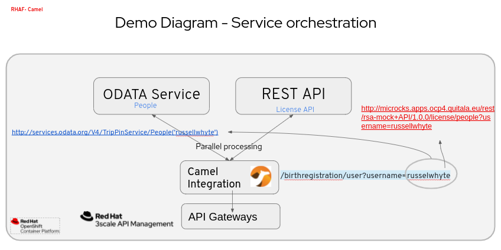
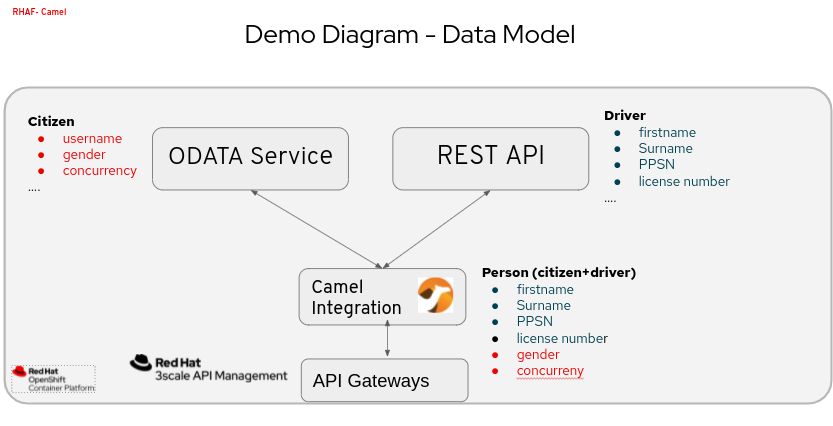

a# camel-odata
Camel (CEQ) demo project for showing an example of OData and REST API service integration

## Prerequisites

The following instructions can deploy the Camel integration on OpenShift or standalone in a VM or bare metal infrastructure. The demo requires these components:   

     • OpenShift Container Platform (optional)
     • JDK 1.17
     • Maven 3.6.3 or higher
     • git
     • Visual Code with the Red Hat Apache Camel plugin and the Karavan plugin 
     • JBang (optional)
     
## Run the demo
Clone this repository in your local development environment.  

### Local environment
  on the root folder type:
  mvn quarkus dev

### OpenShift 
JAVA_HOME=/usr/lib/jvm/jdk-17/ mvn clean package -D skipTests -Popenshift -Dquarkus.kubernetes.deploy=true -Dquarkus.kubernetes-client.trust-certs=true -Dquarkus.openshift.route.expose=true

## Run a YAML DSL with JBang (out of demo scope) 
address to this directory: /src/main/resources/camel and run:
jbang -Dcamel.jbang.version=3.20.3 camel@apache/camel run *  

## DEMO DIAGRAMS

