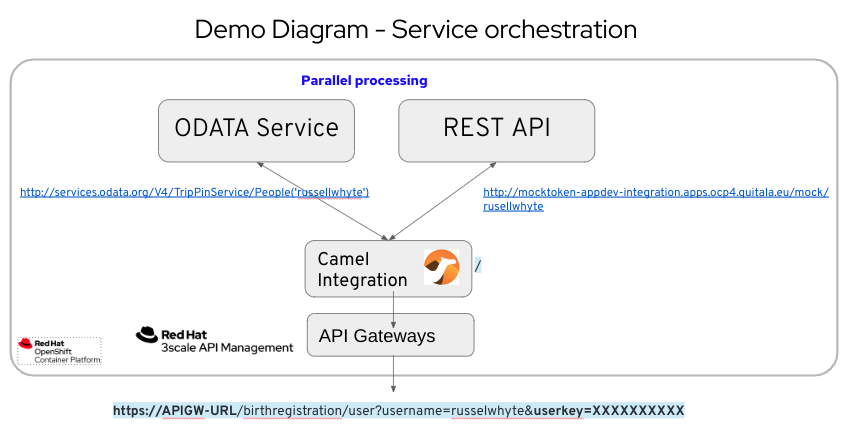

# camel-odata demo
Camel (CEQ) demo project for showing an example of OData and REST API service integration


## Prerequisites

The following instructions can deploy the Camel integration on OpenShift or standalone in a VM or bare metal infrastructure. The demo requires these components:   

     • OpenShift Container Platform (optional)
     • JDK 1.17
     • Maven 3.6.3 or higher
     • git
     • Visual Code with the Red Hat Apache Camel plugin and the Karavan plugin 
     • JBang (optional)
     
## Run the demo
Clone this repository in your local development environment.  

You need to create a mock REST endpoint, in order to create it you have two options:
1. You can use this project to build a mock endpoint in OpenShift with this ConfigMap with this reponse:
   ```
   apiVersion: v1
   kind: ConfigMap
   metadata:
     name: mock-responses
   data:
     openshift.get.message.response1: '{ "ppsn": "1234567", "surName": "Whyte", "firstName": "Rusell", "placeOfBirth": "11-09-1980", "dateOfIssue": "12-10-2000", "dateOfExpiry": "12-10-2035", "licenceNumber": "123456" }'
   ``` 
2. Use Apicurio+Microcks to generate the REST mock endpoint, please find the Mock REST API spec, here:
[Mock API](docs/rsa-mock-API.json)  .This is an example of this mock endpoint with Microcks: http://microcks.apps.ocp4.quitala.eu/rest/rsa-mock+API/1.0.0/license/people?username=russellwhyte

This is the mock OData API : https://services.odata.org/V4/TripPinService/People('russellwhyte')

### Local environment
Run this command on the repo root directory:

     • mvn quarkus dev

     http://localhost:8182/birthregistration/user?username=russellwhyte


### OpenShift 
First you need to sign in OpenShift and run this command on the repo root directory:

     • mvn clean package -D skipTests -Popenshift -Dquarkus.kubernetes.deploy=true -Dquarkus.kubernetes-client.trust-certs=true -Dquarkus.openshift.route.expose=true


## Run a YAML DSL with JBang (out of demo scope) 
Go to this directory: /src/main/resources/camel and run:

     • jbang -Dcamel.jbang.version=3.20.3 camel@apache/camel run *  

## DEMO DIAGRAMS


